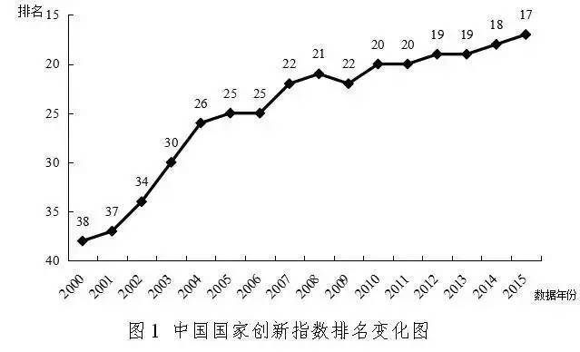

写在前面
-------
这篇文章是我在复旦大学的政治理论课作业。本来是为了交作业东拼西凑的，但为了东拼西凑，看了些资料，最后发现自己写得好像是在歌颂，而不是在找问题。总之，大量篇幅在写中国似乎做得不错，而改进方面的东西写得少之又少。原因是个人水平低下，低于中国平均水平，所以在我看来，中国做得的确比我个人要好太多了，所以对我来说，中国的确是一个学习榜样。

另外，今天重新看了[张维为](https://baike.baidu.com/item/%E5%BC%A0%E7%BB%B4%E4%B8%BA)教授2014年的演讲[《中国信心》](http://v.youku.com/v_show/id_XODg2ODc1OTQ4.html?f=23439218&ev=1&from=y1.3-idx-grid-1519-9909.86808-86807.1-1)，主题是中国人，你要自信。值不值得自不自信先不谈，但最近这些年，我的确对西方特别是美国越来越持质疑态度。

当然，我觉得张维为教授提到的“**民主**与**专制**的讨论已经过时，**良政**与**劣政**的讨论才更重要”这个观点，我觉得真是醍醐灌顶，虽然已经过去4年，但现在意识到这个转变，也是非常值得庆幸的一件事。

提高中国自主创新能力的思考
==============================

什么是自主创新？
------------------------------
自主创新是指通过拥有自主知识产权的独特的核心技术以及在此基础上实现新产品的价值的过程。自主创新包括原始创新、集成创新和引进消化吸收再创新。这是自主创新的内容而非内涵。自主创新的成果，一般体现为新的科学发现以及拥有自主知识产权的技术、产品、品牌等。

当今世界科技迅猛发展，国家竞争力越来越体现在以自主创新为核心的科技实力上，经济竞争力、文化影响力最终取决于自主创新能力。它是综合国力竞争的决定性因素，是支撑一个国家崛起和发展的筋骨，是一国持久核心竞争力的基础，也是企业培育核心竞争力的关键环节。

对于企业来说，自主创新能力就是自主集成和应用各种技术知识并由此获得竞争优势的能力，包括技术搜索能力、学习能力、研究开发能力等；对于国家来说，自主创新能力就是根据社会经济发展的客观要求，有意识地促进科学技术知识的生产、流动和应用并在此过程中创造财富从而实现价值增值的能力。自主创新能力主要是一种制度能力，而不完全是一种技术能力，是国家竞争力的重要组成部分但不等同于国家竞争力。

自主创新的类型
-------------------

**原始创新**：是指前所未有的重大科学发现、技术发明、原理性主导技术等创新成果。原始性创新意味着在研究开发方面，特别是在基础研究和高技术研究领域取得独有的发现或发明。原始性创新是最根本的创新，是最能体现智慧的创新，是一个民族对人类文明进步作出贡献的重要体现。

**集成创新**：是指通过对各种现有技术的有效集成，形成有市场竞争力的产品或者新兴产业。

**引进消化吸收再创新**：是指在引进国内外先进技术的基础上，学习、分析、借鉴，进行再创新，形成具有自主知识产权的新技术。引进消化吸收再创新是提高自主创新能力的重要途径。**发展中国家通过向发达国家直接引进先进技术，尤其是通过利用外商直接投资方式获得国外先进技术，经过消化吸收实现自主创新，不仅大大缩短了创新时间，而且降低了创新风险。**

中国自主创新能力现状
------------------------------

最近几十年来，中国的自主创新能力有了明显提升，中国科学技术发展战略研究院发布的《国家创新指数报告2013》中提到：**中国正在从世界制造中心迈向世界创新中心。**

据 2016 年 6 月 29 日中国科学技术发展战略研究院发布的《国家创新指数报告2015》显示，在 40 个参评国家中，我国国家创新指数排名从 2004 年的第 26 位上升到 2014 年的第 18 位，显著领先于俄罗斯（第 32）、南非（第 36）、印度（第 38）、巴西（第 39）等新兴市场国家。而在《国家创新指数报告2016-2017》中提到，中国排名又上升了一位，到达第 17 位，距离美国领衔的创新国家第一集团还有两位之差。在第二集团中（发展中国家），中国处于领先位置。

《国家创新指数报告2016-2017》指出，中国的 R&D 经费总量继续居世界第 2 位，仅次于美国。R&D人员总量长期居世界第1位。知识创造能力稳步提升。国际科技论文数量居世界第2位；国内发明专利申请量保持世界第1位；国内发明专利授权量已超越日本，居世界第1位。

中国的5个一级指标中仅创新资源在金砖国家中处于第2位，仍落后于俄罗斯，但分差继续缩小，从上年的3分缩小至1.7分。中国的研发人力投入强度、科技人力资源培养水平及信息化水平等方面与俄罗斯还有差距。

总体看来，在发展中国家阵营中，中国进步最快，优势不断扩大。中国R&D经费投入一直处于快速上升通道中，科研创新人员数量在全球范围内已占有绝对优势，专利、论文等科技产出规模已经位居世界前列。只要继续保持全社会创新资源快速增长的态势，中国将逐步实现从要素驱动向创新驱动的转变，支撑中国未来的跨越式发展。

知识产出能力是创新活动水平和创新能力的重要体现，集中反映了一国原始创新能力、创新活跃程度和技术创新水平。国际科技论文和发明专利申请及授权情况是反映知识产出能力的重要指标。中国国际科技论文和发明专利申请量、授权量稳步提高，知识产出能力显著增强。

2015年中国发表的SCI论文被引证次数为60.0万次，占全球比重达到19.9%，与2005年相比提高了15.2个百分点，世界排名从第8位提高到第2位。

全球国内发明专利申请量和授权量主要集中在中国、日本、美国和韩国，这4个国家累计占全球总量的比重约为90%。中国国内发明专利申请量达到96.8万件，占世界总量的52.1%，继续居世界首位。

为什么中国要提高自主创新能力？
------------------------------------
相比美日韩等创新强国而言，中国由于基础薄弱、创新资源积累不足，创新指数得分仍相对较低，未来国家整体创新能力和实力仍存在进一步提升的巨大空间。中国除创新环境外的4个一级指标，其得分还远远落后于指标值排第一（满分100）的美日韩三国（图2-5）。中国创新资源、企业创新和创新绩效3个一级指标得分在60分以下，分别为57.4分、57.8分和46.6分，知识创造得分稍高，达到71.1分。比较上年得分来看，中国只有创新绩效受全球经济形势的影响下降了1.3分，创新资源、知识创造和企业创新3个一级指标得分分别上升了2分、3.9分和1.2分，与排名第一的美日韩差距缩小，创新环境上升了1分，与新加坡的差距缩小，创新环境进一步改善。中国创新指数得分变化既表明了中国与一级指标排名第一的美国、日本和韩国的显著差距，也表明中国创新能力正处于较快提升的通道，与标杆国家的差距有望进一步缩小。

虽然中国的研发经费投入位居世界前列，但是研发人力投入仍在低位徘徊。从中国在5个二级指标方面的国际排名情况看，2015年有3项指标排名保持不变，分别是研究与发展人力投入强度、信息化发展水平和研究与发展经费占世界比重；有2项指标排名出现下降，其中研究与发展经费投入强度从上年第15位降至第17位，科技人力资源培养水平从上年第34位降至第36位。

在人力投入方面，中国的科技人力资源总量和研发人员总量已处于世界领先位置，但高等教育毛入学率和研发人力投入强度这两项指标的表现不佳，国际排名多年来一直处于落后位置，没有较明显的转变。此外，信息化发展水平的排名波动较大，且基本上在30位之后。可见，这几个薄弱环节应成为中国提升创新资源投入水平的关注重点。

在科技论文指标方面，从知识创造分指数所使用的两项反映论文产出效率的标看，排名都比较落后，表明中国的国际论文产出效率和整体影响力仍有待进一步提升。

创新绩效是一个国家开展创新活动所产生的成果和影响的集中表现。创新绩效分指数采用了劳动生产率、单位能源消耗的经济产出、有效发明专利数量占世界比重、高技术产业出口占制造业出口的比重、知识密集型产业增加值占世界比重5项指标，来测度和评价创新活动的产出水平，以及创新活动对经济的贡献。中国创新绩效分指数排名第12位，较上年下降1个位次。

创新环境是提升国家创新能力的重要基础和保障。创新环境分指数选取如下10个二级指标：知识产权保护力度、政府规章对企业负担影响、宏观经济环境、当地研究与培训专业服务状况、反垄断政策效果、员工收入与效率挂钩程度、企业创新项目获得风险资本支持的难易程度、产业集群发展状况、企业与大学研发协作程度及政府采购对技术创新影响。中国创新环境分指数国际排名持续下滑，从上年第19位降至第20位。

在创新环境的二级指标中，中国排名进入前10位的指标有4个：政府规章对企业负担影响、宏观经济环境、企业创新项目获得风险资本支持的难易程度、政府采购对技术创新影响。其中，宏观经济环境指标和政府采购对技术创新影响指标的排名虽然比较靠前，居第6位，但相比2014年均下降了2个位次；企业创新项目获得风险资本支持的难易程度指标扭转了上一年剧烈下滑的局面，上升2个位次重新进入前10强。其他指标排名呈梯度分布，与上年相比有升有降。其中，反垄断政策效果指标较上年提升了3个位次，居第21位；产业集群发展状况指标和企业与大学研发协作程度指标均较上年提升2个位次，分别居第16位和第23位；当地研究与培训专业服务状况指标较上年提升1个位次，居第33位；知识产权保护力度指标继续下滑1个位次至第33位；员工收入与效率挂钩程度指标连续3年出现下滑，2015年下降2个位次至第20位。

总体而言，我国科技创新对经济增长的贡献率还不高，自主创新能力有待提高，亟需借鉴发达国家推动创新等先进经验，进一步完善自主创新政策，构建创新驱动发展战略实施机制，将创新发展理念落到实处。

中国为提高自主创新能力做了哪些努力？
--------------------------------------
近年来，我国高度重视自主创新工作，大力推进建设创新型国家战略，实施了一系列支持自主创新的政策措施。对这些政策效果所做的评估表明，我国创新成果和创新人才大量增加，创新转化效率大幅提升，在世界创新领域中的地位明显提高。

2007 年 12 月 29 日，第十届全国人民代表大会常务委员会第三十一次会议修订了《中华人民共和国科学技术进步法》。

2006 年，我国提出建设创新型国家战略，至今已经整整 10 年。2007年，十七大报告指出，提高自主创新能力，建设创新型国家，把增强自主创新能力贯彻到现代化建设各个方面。2011 年，“十二五”规划纲要提出，坚持自主创新、重点跨越、支撑发展、引领未来的方针，加快建设国家创新体系。2012 年，十八大报告指出，要坚持走中国特色自主创新道路。2015 年，我国研究与试验发展经费支出占 GDP的比重为 2.1%，略低于“十二五”规划 2.2%的目标，但每万人口发明专利拥有量 6.3件，大幅超过 3.3 件的“十二五”规划目标。

### 习近平总书记关于自主创新的重要论述
|讲话|时间|内容 |
|:----:|:----:|:----|
|《在全国科技创新大会、两院院士大会、中国科协第九次全国代表大会上的讲话》|2016.5.30|为建设世界科技强国而奋斗；坚持走中国特色自主创新道路，全面增强自主创新能力|
|《在参加十二届全国人大三次会议上海代表团审议时的讲话》|2015.3.5|国发展到现在这个阶段，不仅从别人那里拿到关键核心技术不可能，就是想拿到一般的高技术也是很难的，西方发达国家有一种教会了徒弟、饿死了师傅的心理，所以立足点要放在自主创新上|
|《在中国科学院第十七次院士大会、中国工程院第十二次院士大会上的讲话》|2014.6.9|面向未来，增强自主创新能力，最重要的就是要坚定不移走中国特色自主创新道路，坚持自主创新、重点跨越、支撑发展、引领未来的方针，加快创新型国家建设步伐|
|《在中国科学院考察工作时的讲话》|2013.7.17|要有强烈的创新自信。我们要引进和学习世界先进科技成果，更要走前人没有走过的路，努力在自主创新上大有作为。如果总是跟踪模仿，是没有出路的|
|《在参加全国政协十二届一次会议科协、科技界委员联组讨论时的讲话》| 2013.3.4 |在日趋激烈的全球综合国力竞争中，我们没有更多选择，非走自主创新道路不可。我们必须采取更加积极有效的应对措施，在涉及未来的重点科技领域超前部署、大胆探索|

我国自主创新政策体系在探索中逐步健全完善。在过去 10 年时间里，我国各级各地政府部门积极响应国家战略，制定了很多鼓励和加强自主创新的政策，涵盖了财税、金融、人才、政府采购、知识产权和技术标准、创新平台等各方面。

在上述政策之外，我国还通过建设国家自主创新示范区，扩大相关科技人员个人所得税优惠和企业所得税优惠，助力打造科技体制改革和创新政策先行区、高端人才与“双创”结合的重要平台、新产业新业态集聚带，在加快自主创新、推动转型升级上探索更多鲜活经验。今年 6 月 8 日，李克强总理主持召开国务院常务会议，决定建设福厦泉与合芜蚌两个国家自主创新示范区，以引领带动体制创新和科技创新。截至今年上半年，国务院一共批复设立了 16 个自主创新示范区。

中国努力提高自主创新能力取得的成果？
-------------------------------------
中国科学技术发展战略研究院发布的《国家创新指数报告 2015》显示，在 40 个参评国家中，我国国家创新指数排名从 2004 年的第 26 位上升到 2014 年的第 18 位，显著领先于俄罗斯（第 32）、南非（第 36）、印度（第38）、巴西（第 39）等新兴市场国家。除了这种指数化评估方法之外，自主创新政策具体实施效果还表现在以下几方面：

**第一，创新成果大量涌现。**
2015 年，我国科技成果登记数近 5.4 万项，专利申请数 171.8 万件，分别是 2005 年的 1.66 倍和 8.03 倍（图 1）。同时，科技论文和专著数量显著增长。此外，我国在多个科技创新领域取得重大突破。航空航天方面，“长征六号”一箭发射20 星，“北斗”系统全球组网首颗卫星发射，“嫦娥三号”月面软着陆开展探测，探月工程三期再入返回飞行试验成功，“神州九号”载人飞船与“天宫一号”实现对接，首架国产大型客机 C919 下线。深海探测方面，“蛟龙”号下潜突破 7000 米，4500 米级深海遥控作业型潜水器海试成功。量子物理和量子通信方面，首次实现多自由度量子隐形传态，量子通信安全传输创世界纪录。高铁方面，世界首条高寒地区高铁哈大客运专线开通运营，突破了防冻胀路基、接触网融冰、道岔融雪等三大技术难题。

**第二，创新人才快速增加。**
2015 年，我国科技人力资源总量超过 7100 万人，研发人员超过 535 万人，其中企业研发人员398万人；R&D折合全时人员当量1约390万人年，相当于2005年的 2.85 倍。在引进人才方面，各项人才计划提高了我国对高端人才和创新人才的吸引力，近5年回国人才数量超过110万人，是前30年的3倍。在培养人才方面，R&D人员全时当量是指全时人员数加非全时人员按工作量折算为全时人员数的总和，为国际上比较科技人力投入而制定的可比指标。例如：有两个全时人员和三个非全时人员(工作时间分别为 20%、30%和 70%)，则全时当量为2+0.2+0.3+0.7=3.2人年。 目前我国理工科博士学位授予数量每年达到 3 万人左右，仅次于美国，居世界第二位。

**第三，创新成果有效转化。**
2015 年，全国共签订技术合同30.7万项，成交金额9835亿元，分别是2006年的1.49倍和4.41倍；同时，高技术产品出口规模显著扩大，连续三年超过 6500 亿美元，占我国出口总额的近 30%。在一些新技术新产品上，创新成果转化表现得更加突出。比如，我国已全面掌握特高压输变电技术，关键设备实现了国产化；大功率风电机组、晶硅和薄膜太阳电池等关键技术取得突破，目前我国风能和光伏产能装机容量均居世界第一；2015 年我国新能源汽车产销量均突破 30 万辆，成为全球最大的新能源汽车市场。

中国的自动驾驶技术也领先世界，连美国也使用了中国百度开发的自动驾驶技术；在上海，嘉定到虹桥一段试验路程，运行的全部是自动驾驶的车辆，不仅做到了车辆自动驾驶，还使用 V2X 技术做到了车辆与车辆间的交互，甚至车辆与交通信号灯之间的交互，可以实现全程无红灯驾驶。

**第四，创新创业热潮兴起。**
2015年，我国平均每天新登记注册企业1.2万户，比2014年提升20%；新增各类创业孵化器24000多家，超过了此前近30年所有孵化器的总和。

上海还兴起了中国的首家的创客中心：新车间。这是一个非盈利组织，定期举办工作坊，鼓励大家自己动手将自己的想法实现。

中国要提高自主创新能力还需做哪些努力？
--------------------------------
### 可以从美国借鉴的经验：
**第一，完善创新顶层设计。**

**第二，激发创新主体动力。**

**第三，加大创新研发投入。**

**第四，培育创新人才队伍。**

**第五，打造创新金融体系。**

### 政策建议

**第一，明确创新战略实施机制。**

**第二，完善创新成果评价体系。**

**第三，提升创新成果转化效率。**

**第四，充实扩大创新人才库。**

**第五，探索金融支持创新模式。**

参考资料：
----------------------------
[【1】世界经济论坛.《全球竞争力报告2016-2017》。](./参考文献/TheGlobalCompetitivenessReport2016-2017_FINAL.pdf)

[【2】《中华人民共和国科学技术进步法》。](./参考文献/中华人民共和国科学技术进步法.md)

[【3】中银研究.《宏观观察》。](./参考文献/中银研究宏观观察.pdf)

[【4】中国科学技术发展战略研究院.《国家创新指数报告2013》](./参考文献/国家创新指数报告2013.pdf)

[【5】中国科学技术发展战略研究院.《国家创新指数报告2016-2017》](./参考文献/国家创新指数报告2016-2017.pdf)