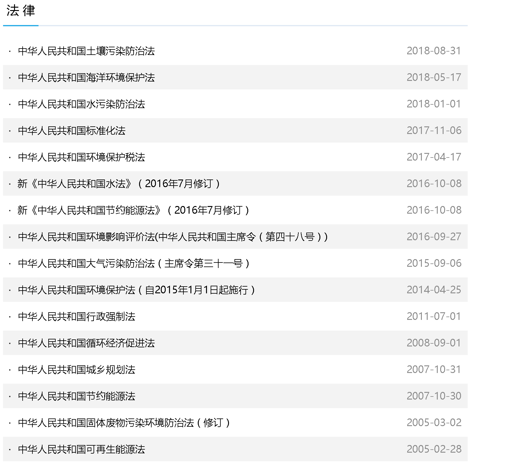

新华社评论员：保护生态环境　建设美丽中国——学习贯彻
习近平总书记在全国生态环境保护大会重要讲话
------
新华社北京５月１９日电 题：保护生态环境　建设美丽中国——学习贯彻习近平总书记在全国生态环境保护大会重要讲话

　　新华社评论员

　　“生态环境是关系党的使命宗旨的重大政治问题，也是关系民生的重大社会问题。”习近平总书记在全国生态环境保护大会发表重要讲话，站在党和国家事业发展全局高度，全面总结党的十八大以来生态文明建设取得的重大成就，科学分析当前面临的任务挑战，对新时代推进生态文明建设确立了重要原则、进行了具体部署。讲话展现强烈使命担当、蕴含深厚民生情怀、具有宽广全球视野，发出了建设美丽中国的进军号令。

　　生态文明建设是关系中华民族永续发展的根本大计。党的十八大以来，在以习近平同志为核心的党中央坚强领导下，我们开展了一系列根本性、开创性、长远性的工作，推动我国生态环境保护从认识到实践发生了历史性、转折性、全局性变化。当前，生态文明建设正处于压力叠加、负重前行的关键期，已进入提供更多优质生态产品以满足人民日益增长的优美生态环境需要的攻坚期，也到了有条件有能力解决生态环境突出问题的窗口期。“有智不如乘势”。把握新形势，解决新问题，完成新任务，我们就能回应广大群众热切期盼，推动我国生态文明建设再上新台阶。

　　新时代推进生态文明建设，坚持“六项原则”是根本遵循。“六项原则”明确了人与自然和谐共生的基本方针，绿水青山就是金山银山的发展理念，良好生态环境是最普惠的民生福祉的宗旨精神，山水林田湖草是生命共同体的系统思想，用最严格制度最严密法治保护生态环境的坚定决心以及共谋全球生态文明建设的大国担当。这些重要论断构成一个紧密联系、有机统一的思想体系，深刻揭示了经济发展和生态环境保护的关系，深化了对经济社会发展规律和自然生态规律的认识，为我们坚定不移走生产发展、生活富裕、生态良好的文明发展道路指明了方向。

　　新时代推进生态文明建设，加快构建生态文明体系是制度保障。制度才能管根本、管长远。严格的制度、严密的法治，可以为生态文明建设提供可靠保障。要以生态价值观念为准则，以产业生态化和生态产业化为主体，以改善生态环境质量为核心，以治理体系和治理能力现代化为保障，以生态系统良性循环和环境风险有效防控为重点，加快建立健全生态文化体系、生态经济体系、目标责任体系、生态文明制度体系、生态安全体系，为确保到２０３５年美丽中国目标基本实现，到本世纪中叶建成美丽中国提供有力制度保障。

　　新时代推进生态文明建设，全面推动绿色发展是治本之策。坚持绿色发展是发展观的一场深刻革命，是构建高质量现代化经济体系的必然要求，也是解决污染问题的根本之策。要围绕调整经济结构和能源结构等重点，培育壮大环保产业、循环经济，倡导绿色低碳生活方式；把解决突出生态环境问题作为民生优先领域，打赢蓝天保卫战这个重中之重；有效防范生态环境风险，提高环境治理水平，让良好生态环境成为人民生活的增长点、经济社会持续健康发展的支撑点和展现我国良好形象的发力点。

　　新时代推进生态文明建设，打好污染防治攻坚战是重点任务。污染防治攻坚战时间紧、任务重、难度大，是一场大仗、硬仗、苦仗，必须加强党的领导，各地区各部门坚决担负起生态文明建设的政治责任是关键。要建立科学合理的考核评价体系，对损害生态环境的领导干部终身追责，为敢干事、能干事的干部撑腰打气，建设一支生态环境保护铁军，守护好生态文明的绿色长城。

　　中华民族向来尊重自然、热爱自然，绵延５０００多年的中华文明孕育着丰富的生态文化。我们要认真学习领会习近平生态文明思想，坚持绿色发展理念，持之以恒推进生态文明建设，把伟大祖国建设得更加美丽，为子孙后代留下天更蓝、山更绿、水更清的优美环境，这是我们的责任，也是对人类的贡献。

中国生态环境状况
------------------------

中国生态环境是指人们生活环境的状况。主要表现在水土流失，垃圾污染，大气污染，噪音污染等方面。我国生态环境的基本状况是:总体环境在恶化，局部环境在改善，治理能力远远赶不上破坏速度，生态赤字在逐渐扩大。

主要表现
水土流失严重

建国初期，全国水土流失面积为116万平方公里。据1992年卫星遥感测算，中国水土流失面积为179.4万平方公里，占全国国土面积的18.7%。中国水土流失特别严重的地区(从北到南)主要有:西辽河上游，黄土高原地区，嘉陵江中上游，金沙江下游，横断山脉地区，以及部分南方山地丘陵区。

沙漠化迅速发展

中国是世界上沙漠化受害最深的国家之一。北方地区沙漠、戈壁、沙漠化土地已超过149万平方公里，约占国土面积的15.5%。80年代，沙漠化土地以年均增长2100平方公里的速度扩展。近25年共丧失土地3.9万平方公里。目前约有5900万亩农田，7400万亩草场，2000多公里铁路以及许多城镇、工矿、乡村受到沙漠化威胁。

草原退化加剧

70年代，草场面积退化率为15%，80年代中期已达30%以上。全国草原退化面积达10亿亩，目前仍以每年2000多万亩退化速度在扩大。由于草原的严重退化，从而导致牧草产量持续下降。

森林资源锐减

中国许多主要林区，森林面积大幅度减少，昔日郁郁葱葱的林海已一去不复返。全国森林采伐量和消耗量远远超过林木生长量。若按目前的消耗水平，绝大多数国营森工企业将面临无成熟林可采的局面。森林赤字是最典型的生态赤字，当代人已经过早过多地消耗了后代人应享用的森林资源。

生物物种加速灭绝

据估计，中国的植物物种中约15-20%处于濒危状态，仅高等植物中濒危植物就高达4000-5000种。近30多年来的资料表明，高鼻羚羊、白鳍豚、野象、熊猫、东北虎等珍贵野生动物分布区显著缩小，种群数量锐减。属于中国特有的物种和国家规定重点保护的珍贵、濒危野生动物有312个种和种类，正式列入国家濒危植物名录的第一批植物有354种。

地下水位下降

多年来，由于过分开采地下水，在北方地区形成8个总面积达1.5万平方公里的超产区，导致华北地区地下水位每年平均下降12厘米。1949年以来，中国湖泊减少了500多个，面积缩小约1.86万平方公里，占现有面积的26.3%，湖泊蓄水量减少513亿立方米，其中淡水量减少340亿立方米。

水体污染明显加重

据1987年典型城市监测调查，有42%的城市饮用水源地受到严重污染;63%的城市受到不同程度的污染。在调查的532条河流中，有82%的河流受到不同程度的污染。全国约有7亿人口饮用大肠杆菌超标水，约有1.7亿人饮用受有机物污染的水。

大气污染严重

中国大气污染属于煤烟型污染，北方重于南方;中小城市污染势头甚于大城市;产煤区重于非产煤区;冬季重于夏季;早晚重于中午。目前中国能源消耗以煤为主，约占能源消费总量的四分之三。煤是一种肮脏能源，燃烧产生大量的粉尘、二氧化碳等污染物，是中国大气污染日益严重的主要原因。近年来，废渣存放量过大，垃圾包围城市。中国废渣年产生量已超过5亿吨，处理能力赶不上排放量。1988年全国积存量为66亿吨，人均6吨废渣。据统计，全国城市生活垃圾为6000万吨/年，比10年前增加了一倍。在380个城市中，至少有三分之二的城市处在垃圾包围之中。仅北京三环、四环路之间就有50米以上的垃圾山4500多座，占地超过7000亩。

环境污染向农村蔓延

乡镇企业迅速发展成为农村工业化的重要方向，以及二元经济结构向现代经济结构转变的中介。与此同时，也给农村带来生态环境更大范围的污染，对农业资源、矿产资源造成更为严重的浪费。1978年以前，农村环境污染主要是化肥、农药等，1978年以后乡镇企业成为农村主要污染源。

环境是一种特殊资产。生态破坏、环境污染本身就构成经济损失和财富流失。生态指标恶化已经直接而明显地影响了现期经济指标和预期经济趋势。

折叠编辑本段三大生态压力
折叠人口压力
中国现代人口数量异常迅猛增长，既成为中国现代化进程的最大障碍，又成为中国生态环境的最大压力。迫于生存，人们毁林开荒，围湖造田，乱采滥挖，破坏植被，众多人口的不合理活动超过了大自然许多支持系统的支付能力、输出能力和承载力。

折叠工业化压力
中国发动工业化时间晚，发展起点低，又面临赶超发达国家的繁重任务，不仅以资本高投入支持经济高速增长，而且以资源高消费、环境高代价换取经济繁荣，重视近利，失之远谋;重视经济，忽视生态，短期性经济行为为中国生态环境带来长期性、积累性后果。

折叠市场压力
中国正处在市场经济转型过程中。市场经济本身会产生许多外部经济效应或者外部不经济效应，环境污染就是最明显的例子。环境作为一种公共财产，这种公共财产的提供(例如清洁水，良好的大气环境)，对所有人都有好处且多一些人享受它的好处并不会加大总成本。但是如果没有公共财产，所有人的利益都会受损。公共财产或者公共财产受到破坏(例如污染水，污染大气等)的特点决定了个人或市场都不会提供控制环境污染的费用和服务，只有政府是公共财产的提供者。来自市场经济的压力愈大，政府对防治环境污染、整治国土资源的责任就愈大。为了改变中国日益恶化的环境形势，采取行动刻不容缓。否则，日益扩大的生态赤字将使其他领域所获得的成绩不是大打折扣，就是黯然失色。